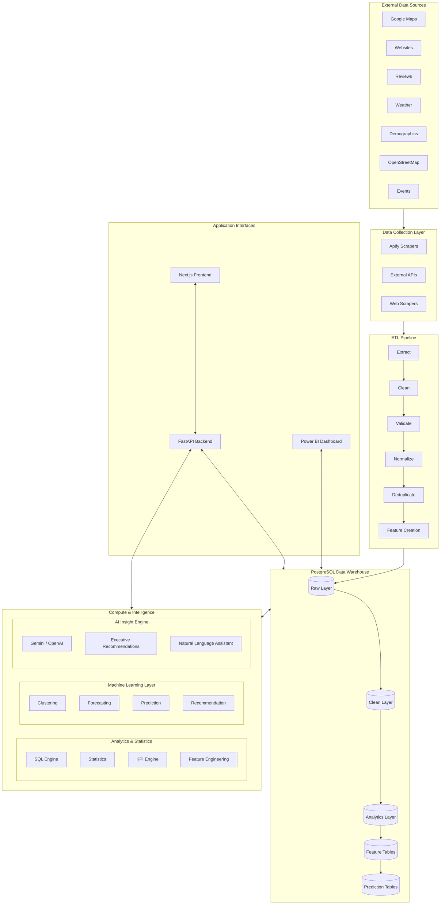

# Project Polaris Architecture

Welcome to **Project Polaris**, a comprehensive data platform designed to aggregate, process, analyze, and visualize data from various external sources.

## System Overview

The system is composed of several distinct layers, taking data from its raw form on the web to actionable insights on executive dashboards.

## 1. External Data Sources
Project Polaris ingests data from a variety of external services:
- **Google Maps**: Location data, places, ratings.
- **Websites**: Scraping public company or location info.
- **Reviews**: Customer sentiment from Yelp, Google, etc.
- **Weather**: Historical and forecast weather data.
- **Demographics**: Census and local population statistics.
- **OpenStreetMap**: Geographical and spatial data.
- **Events**: Local events and gatherings.

## 2. Data Collection Layer
- **Apify**: Managed actors for scalable web scraping.
- **APIs**: Direct integrations with 3rd-party vendors.
- **Web Scrapers**: Custom Python scrapers (e.g., `collect_google_data.py`).

## 3. ETL Pipeline
Our pipeline ensures high data quality through the following sequential steps:
`Extract` ➔ `Clean` ➔ `Validate` ➔ `Normalize` ➔ `Deduplicate` ➔ `Feature Creation`.

## 4. PostgreSQL Data Warehouse
Data is stored using a multi-layered architectural pattern:
- **Raw Layer**: Unmodified JSON or tabular data from sources.
- **Clean Layer**: Normalized, strictly typed data.
- **Analytics Layer**: Aggregated views for reporting.
- **Feature Tables**: Prepared datasets for machine learning.
- **Prediction Tables**: Outputs generated by ML models.

## 5. Compute & Intelligence
- **Analytics & Statistics**: SQL-based metric generation and KPI engines.
- **Machine Learning**: Clustering models, time-series forecasting, predictions, and recommendations.
- **AI Insight Engine**: Integrated LLM capabilities (Gemini/OpenAI) for executive summaries and a natural language assistant.

## 6. Interfaces & Presentation
- **Backend (FastAPI)**: Serves REST APIs, handles authentication, filtering, and search.
- **Frontend (Next.js)**: Features the Executive Dashboard, Competitor Analysis, Business Profiles, Forecasts, Maps, and Reports.
- **Power BI**: For advanced data exploration, ad-hoc KPI reports, and market analysis.
